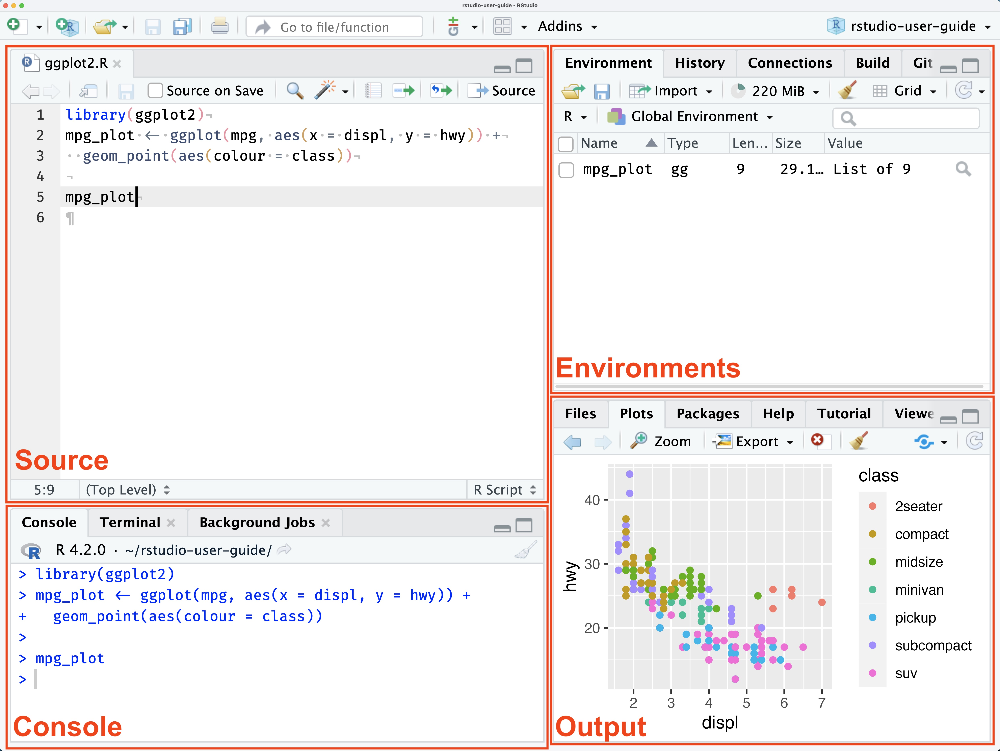

# Introduction to R

\newcommand{\E}{\mathbb{E}}
\newcommand{\R}{\mathbb{R}}
\newcommand{\var}{\mathbb{V}ar}
\newcommand{\cov}{\mathbb{C}ov}
\newcommand{\corr}{\mathbb{C}orr}
\newcommand{\unif}{\operatorname{Unif}}
\newcommand{\geom}{\operatorname{Geom}}
\newcommand{\bet}{\operatorname{Beta}}
\newcommand{\bern}{\operatorname{Bern}}
\newcommand{\iid}{\overset{iid}{\sim}}
\newcommand{\ef}{\operatorname{Eff}}
\newcommand{\htt}{\hat{\theta}}


> Learning objectives
>
> By the end of this chapter, you should be able to:
>
> 1. Describe how R reads, evaluates, and prints an expression.
> 2. Distinguish an object from the name bound to that object.
> 3. Identify the major data types and data structures in R.
> 4. Predict how vectorization, coercion, recycling, and missing values affect a computation.
> 5. Create, inspect, index, and modify vectors, matrices, arrays, lists, and data frames.
> 6. Write and use simple R functions.
> 7. Choose appropriately among vectorization, loops, and the `apply()` family.
> 8. Use the tidyverse pipe and core `dplyr` verbs to express a data-analysis pipeline.
> 9. Write computations that are reproducible, readable, and numerically responsible.

## Why R?

Modern statistical analyses routinely involve hundreds, thousands, or millions of observations. The calculations are too numerous, and often too complex, to perform reliably by hand. We therefore need software that can manage data, implement statistical methods, automate repeated computations, and document the complete analysis.

**R** is both a high-level programming language and an environment for statistical computing and graphics. It is especially useful for statistics because it is:

- **free and open source**, so students and researchers can use the same tools;
- **designed for data analysis**, with vectors, missing values, statistical models, and graphics built into the language;
- **extensible**, with a large ecosystem of packages developed by researchers and software developers;
- **reproducible**, because an analysis can be saved as code and rerun from beginning to end;
- **interoperable**, with interfaces to databases and languages such as C++, Python, and Julia.

R is not a menu-driven statistics program. Learning R means learning to express an analysis as a sequence of precise and reproducible computations.

::: {.callout-note title="R, RStudio, and Quarto are different tools"}

**R** performs the computation. **RStudio** is an integrated development environment that helps us write and run code. **Quarto** combines text, code, results, figures, equations, and references into reproducible HTML, PDF, Word, or presentation output.

:::

## The working environment

There are different integrated development environment to use R, some of them are Rstudio, VS Code and Positron.


**Rstudio**

RStudio is an integrated development environment (IDE) designed specifically for working with the R programming language. It provides a user-friendly interface that includes a source editor, console, environment pane, and tools for plotting, debugging, version control, and package management. RStudio supports both R and Python and is widely used for data analysis, statistical modeling, and reproducible research. It also integrates seamlessly with tools like R Markdown, Shiny, and Quarto, making it popular among data scientists, statisticians, and educators.

**Visual Studio Code (VS Code)**

VS Code is a versatile code editor that supports multiple programming languages, including R. With the R extension for VS Code, users can write and execute R code, access R’s console, and utilize features like syntax highlighting, code completion, and debugging. While not as specialized as RStudio for R development, VS Code offers a lightweight alternative with extensive customization options and support for various programming tasks.

**Positron**

Positron IDE is the next-generation integrated development environment developed by Posit, the company behind RStudio. Designed to be a modern, extensible, and language-agnostic IDE, Positron builds on the strengths of RStudio while supporting a broader range of languages and workflows, including R, Python, and Quarto.


### RStudio

RStudio is an integrated development environment (IDE) for R, Python, and reproducible publishing. Its default layout contains four panes:

| Pane | Main purpose |
| --- | --- |
| **Source** | Write and edit scripts and Quarto documents. |
| **Console** | Send expressions directly to R and view immediate results. |
| **Environment/History** | Inspect objects and review previous commands. |
| **Files/Plots/Packages/Help/Viewer** | Navigate files, inspect graphics, manage packages, read documentation, and preview output. |

Use the console for short experiments. Any computation that matters should be placed in an R script or Quarto document so that it can be reproduced.


{#fig-rstudio-panes width=80% fig-align="center"} 

### R scripts and Quarto documents

An R script is a plain-text file with the extension `.R`. It contains R expressions that can be executed one line, one selection, or one file at a time.

A Quarto document has the extension `.qmd`. It combines:

- a YAML header describing the document;
- prose written in Markdown;
- executable code chunks;
- tables, equations, figures, citations, and cross-references.

For example, an executable R chunk is written as


```{r}
#| echo: fenced

x <- rnorm(100)
mean(x)
```

Rendering the document executes the enabled chunks in order and places their results into the final output.

### A project-oriented workflow

Create one RStudio Project for the course or for each substantial analysis. Use project-relative paths such as `data/survey.csv` rather than hard-coded paths tied to one computer.

A simple project might contain:

```text
stat8670-project/
├── data/          # original and processed data
├── R/             # reusable functions
├── figures/       # saved figures
├── notes/         # Quarto lecture or analysis files
└── stat8670-project.Rproj
```

Avoid using `setwd()` inside a reproducible document. When a project is opened, its root provides a stable reference point for relative paths.


## R as a computing environment

At the console, R follows a **read, evaluate, print loop** (REPL):

1. **Read:** parse the text entered by the user.
2. **Evaluate:** compute the value of the expression.
3. **Print:** display the result when appropriate.
4. **Loop:** wait for the next expression.

```{r}
2 + 3 * 4
```

R respects operator precedence, so multiplication is performed before addition.

```{r}
(2 + 3) * 4
```

Assignment usually returns its value invisibly:

```{r}
x <- 2 + 3 * 4
x
```

::: {.callout-tip title="A useful mental model"}
Most R code can be understood as **functions operating on objects**. Even operators such as `+` are functions.
:::

```{r}
`+`(2, 3)
```

## Objects, data, and functions

Two fundamental kinds of objects that we will work with are:

1. **Data objects**
2. **Functions**

Data objects include numbers, vectors, matrices, arrays, lists, data frames, and fitted models.

A **function** is a set of instructions that receives input, performs a computation, and returns an output. Functions can be built into R, provided by a package, or written by the user.

```{r}
mean(c(1, 2, 3, 4))
```

Here, `c(1, 2, 3, 4)` is a data object and `mean()` is a function.

## Expressions, objects, and names

R computes with **objects**. A **name** is a symbol bound to an object.

```{r}
sample_size <- 100
another_name <- sample_size

sample_size
another_name
```

The assignment operator `<-` creates or changes a binding.

Names are case-sensitive:

```{r}
n <- 10
N <- 25

c(n = n, N = N)
```

A useful naming convention is to separate words using `_`:

```{r}
sample_mean <- 10
number_students <- 30
```

Use `ls()` to list names in the current environment and `rm()` to remove a binding.

```{r}
temporary_result <- 42
"temporary_result" %in% ls()

rm(temporary_result)

"temporary_result" %in% ls()
```

## Data types

The fundamental data structure in R is the **vector**. An atomic vector contains elements of one common type.

Common atomic types include:

| Type | Example | Typical use |
| --- | --- | --- |
| logical | `TRUE`, `FALSE` | conditions and indicators |
| integer | `2L` | counts and indices |
| double | `2`, `3.14` | numerical computation |
| character | `"R"` | text and labels |
| complex | `1 + 2i` | complex arithmetic |
| raw | `charToRaw("R")` | bytes |

```{r}
logical_vector <- c(TRUE, FALSE, TRUE)
integer_vector <- c(1L, 2L, 3L)
double_vector <- c(1, 2, 3)
character_vector <- c("one", "two", "three")

typeof(logical_vector)
typeof(integer_vector)
typeof(double_vector)
typeof(character_vector)
```

### Changing data types

Data types can be explicitly converted, but conversion may result in information loss.

```{r}
x <- pi
x

x_int <- as.integer(x)
x_int
```

Here, converting \(\pi\) to an integer removes its decimal component.

Common conversion functions include:

- `as.integer()`
- `as.numeric()`
- `as.character()`
- `as.logical()`
- `as.Date()`
- `as.factor()`
- `as.list()`
- `as.matrix()`
- `as.data.frame()`
- `as.vector()`
- `as.complex()`

::: {.callout-warning title="Type conversion can lose information"}
Always inspect the result after converting an object from one type to another.
:::

## Operators

### Unary and binary operators

A **unary operator** operates on one object:

```r
-x
!x
```

A **binary operator** operates on two objects:

```r
x + y
x - y
x * y
x / y
```

### Comparison operators

Comparison operators return logical values:

```r
x == y
x != y
x < y
x > y
x <= y
x >= y
```

### Logical operators

Logical operators combine logical values:

```r
x & y
x | y
!x
```

The operators `&` and `|` operate element by element.

```{r}
x <- c(TRUE, FALSE, FALSE)
y <- c(TRUE, TRUE, FALSE)

x | y
x & y
```

By contrast, `&&` and `||` are intended for a single logical condition and are commonly used inside `if` statements.

## Vectorization

Many R functions and operators act on entire vectors.

```{r}
x <- c(1, 2, 3, 4)

x^2
sqrt(x)
sum(x)
mean(x)
```

Vectorized code often expresses statistical calculations more directly than element-by-element code.

## Recycling

Arithmetic between vectors is usually element-wise.

```{r}
x <- c(10, 20, 30)
y <- c(1, 2, 3)

x + y
```

If one vector is shorter, R may **recycle** its values.

```{r}
c(10, 20, 30, 40) + c(1, 2)
```

When the shorter length does not divide the longer length exactly, R produces a warning.

```{r}
#| warning: true
c(10, 20, 30, 40) + c(1, 2, 3)
```

## Coercion

An atomic vector must have one type. Combining different types may cause R to convert values to a common type.

```{r}
mixed_numeric <- c(TRUE, 2L, 3.5)
mixed_character <- c(TRUE, 2L, 3.5, "four")

mixed_numeric
typeof(mixed_numeric)

mixed_character
typeof(mixed_character)
```

A simplified coercion hierarchy is:

```text
logical → integer → double → complex → character
```

Inspect unfamiliar objects using

```r
typeof()
class()
length()
str()
```

## Missing and special values

R uses `NA` to represent a missing value.

```{r}
day <- c("Monday", "Tuesday", "Wednesday", "Thursday", "Friday")
weather <- c("Raining", "Sunny", NA, "Windy", "Snowing")

weather_data <- data.frame(day, weather)
weather_data
```

Missing values usually propagate through calculations:

```{r}
scores <- c(88, NA, 91, 84)

mean(scores)
mean(scores, na.rm = TRUE)

is.na(scores)
```

Do not use

```r
x == NA
```

to detect missing values. Use

```r
is.na(x)
```

instead.

Other special numerical values include

```{r}
c(1 / 0, -1 / 0, 0 / 0)
```

which produce `Inf`, `-Inf`, and `NaN`.

## Indexing and subsetting

Indexing allows us to access or modify parts of an object.

::: {.callout-important title="R indexing begins at 1"}
Unlike languages such as Python and C++, R uses **1-based indexing**. The first element is indexed by `1`, not `0`.
:::

For a vector:

```{r}
x <- c(first = 10, second = 20, third = 30, fourth = 40)

x[1]
x[c(1, 3)]
x[-2]
x[x >= 30]
x[c("second", "fourth")]
```

Positive integers select positions, negative integers exclude positions, logical values filter positions, and character values select named elements.

::: {.callout-warning title="A common surprise"}
Prefer `seq_along(x)` to `1:length(x)` when iterating over the positions of an object.
:::

```{r}
empty <- numeric(0)

1:length(empty)
seq_along(empty)
```

## Naming elements

Names can be attached to vector elements:

```{r}
temp <- c(20, 30, 27, 31, 45)

names(temp) <- c("Mon", "Tues", "Wed", "Thurs", "Fri")

temp
temp["Wed"]
```

A vector does not have rows, so this is inappropriate:

```r
rownames(temp) <- "Day1"
```

A matrix can have row and column names:

```{r}
temp_mat <- matrix(c(20, 30, 27, 31, 45),
                   nrow = 1,
                   ncol = 5)

colnames(temp_mat) <- c("Mon", "Tues", "Wed", "Thurs", "Fri")
rownames(temp_mat) <- "Day1"

temp_mat
```

## Arrays and matrices

An **array** is a multidimensional data structure.

```{r}
array_1d <- array(1:10, dim = 10)
array_1d

array_2d <- array(1:12, dim = c(4, 3))
array_2d

array_3d <- array(1:24, dim = c(4, 3, 2))
array_3d
```

A **matrix** is a two-dimensional array:

```{r}
my_matrix <- matrix(1:12, nrow = 4, ncol = 3)
my_matrix
```

```{r}
is.matrix(array_2d)
is.matrix(my_matrix)

is.array(array_2d)
is.array(my_matrix)
```

A matrix is an atomic vector with a `dim` attribute, so all entries must share one common type.

```{r}
A <- matrix(1:6, nrow = 2, ncol = 3)

attributes(A)
A[2, 3]
```

Matrix multiplication uses `%*%`:

```{r}
B <- matrix(c(1, 0, 0, 1, 1, 1), nrow = 3)

A %*% B
```

while `*` performs element-wise multiplication.

## Lists and key-value pairs

A list can contain objects of different types and lengths.

```{r}
fit_summary <- list(
  method = "least squares",
  coefficients = c(intercept = 1.2, slope = 0.8),
  converged = TRUE
)

str(fit_summary)
```

Named list elements naturally form **key-value pairs**.

```{r}
key1 <- "Tues"
value1 <- 32

key2 <- "Wed"
value2 <- 28

list_temp <- list()

list_temp[[key1]] <- value1
list_temp[[key2]] <- value2

list_temp
```

Values can then be obtained from their keys:

```{r}
list_temp[["Tues"]]
list_temp$Tues
```

For lists, note the important distinction:

```{r}
fit_summary["coefficients"]
fit_summary[["coefficients"]]
```

`[` returns a sublist, whereas `[[` extracts the element itself.

## Factors

A factor represents categorical data using integer codes and a set of levels.

```{r}
group <- factor(c("control", "treatment", "control"))

group
unclass(group)
levels(group)
```

The order of factor levels matters in statistical models, so define it deliberately when necessary.

## Data frames

A **data frame** is a two-dimensional rectangular data structure.

Conceptually, a data frame is a named list of equal-length vectors:

- each row represents an observational unit;
- each column represents a variable;
- columns may have different data types.

```{r}
students <- data.frame(
  id = 1:6,
  name = c("Alice", "Bob", "Chen", "Divya", "Elena", "Farah"),
  program = c("MS", "PhD", "MS", "PhD", "MS", "PhD"),
  score = c(90, 85, NA, 94, 88, 91),
  completed = c(TRUE, TRUE, FALSE, TRUE, TRUE, TRUE)
)

students
```

Another familiar built-in data frame is:

```{r}
iris <- datasets::iris
head(iris)
```

### Inspecting a data frame

Always inspect newly imported data before analyzing them.

```{r}
class(students)
dim(students)
nrow(students)
ncol(students)
names(students)
str(students)
summary(students)
head(students, 3)
```

`str()` is especially useful because it gives a compact summary of the object's structure and types.

### Subsetting a data frame

Use

```r
data[rows, columns]
```

for two-dimensional indexing:

```{r}
students[1, ]
students[, c("name", "score")]
students[students$program == "PhD", ]
students[1:3, c("name", "score")]
students[2, "score"]
```

Three commonly used ways to extract a column are:

```{r}
students["score"]
students[["score"]]
students$score
```

The first returns a one-column data frame. The latter two return the underlying vector.

### Adding and modifying variables

```{r}
students$passed <- students$score >= 70

students$centered_score <-
  students$score - mean(students$score, na.rm = TRUE)

students
```

Missingness propagates naturally. If a score is unknown, whether the student passed is also unknown.

### Importing rectangular data

```{r}
#| eval: false

survey <- read.csv(
  "data/survey.csv",
  na.strings = c("", "NA", ".")
)

measurements <- read.table(
  "data/measurements.txt",
  header = TRUE,
  sep = "\t"
)
```

After importing, check:

```{r}
#| eval: false

dim(survey)
names(survey)
str(survey)
head(survey)
colSums(is.na(survey))
```

::: {.callout-note title="Data import is part of the analysis"}
Import settings such as delimiters, missing-value codes, decimal marks, encodings, and inferred variable types can change the data that R sees and therefore affect the final analysis.
:::

::: {.callout-warning title="Do not automatically treat a data frame as a matrix"}
`apply()` first converts a data frame to a matrix. A mixed-type data frame can therefore be converted entirely to character values. Use `lapply()`, `vapply()`, or `dplyr::across()` for column-wise operations when types differ.
:::

## Functions

A function packages a computation so that it can be reused.

```{r}
standardize <- function(x, remove_na = FALSE) {
  center <- mean(x, na.rm = remove_na)
  spread <- sd(x, na.rm = remove_na)

  (x - center) / spread
}

standardize(c(2, 4, 6, 8))
```

A function has three main components:

- **formals:** the arguments;
- **body:** the expressions evaluated;
- **environment:** where the function was created.

```{r}
formals(standardize)
body(standardize)
environment(standardize)
```

When a function is called, R creates a temporary environment, matches the arguments, evaluates the body, and returns the value of the final expression unless `return()` is called earlier.

### Argument matching

Arguments can be matched by name or position.

```{r}
round(x = 3.14159, digits = 3)
round(3.14159, 3)
```

Named arguments are often clearer in code intended to be read by others.

### Lazy evaluation

R evaluates function arguments only when they are needed.

```{r}
choose_one <- function(x, y) {
  x
}

choose_one(
  10,
  stop("This argument is never evaluated")
)
```

This behavior is called **lazy evaluation**.

## Environments and lexical scoping

An environment stores name-object bindings and has a parent environment.

R uses **lexical scoping**: functions look for nonlocal names in the environment where they were defined.

```{r}
make_power <- function(power) {
  function(x) {
    x^power
  }
}

square <- make_power(2)
cube <- make_power(3)

square(5)
cube(5)
```

A function together with its defining environment is called a **closure**.

Local assignment affects the current function environment:

```{r}
x <- 100

change_locally <- function() {
  x <- 5
  x
}

change_locally()
x
```

## Memory and copy-on-modify

R behaves as if objects are copied when modified.

```{r}
x <- c(10, 20, 30)
y <- x

y[1] <- 999

x
y
```

Changing `y` does not change `x`.

Repeatedly expanding an object can require many allocations:

```{r}
#| eval: false

result <- numeric(0)

for (i in seq_len(100000)) {
  result <- c(result, i^2)
}
```

Instead, preallocate the required memory:

```{r}
n <- 100000

result <- numeric(n)

for (i in seq_len(n)) {
  result[i] <- i^2
}

head(result)
```

## Iteration: vectorization, loops, and the apply family

An iterative computation can usually be expressed in several ways.

```{r}
x <- c(2, 4, 6, 8)

# Vectorized
x^2

# Preallocated loop
squares <- numeric(length(x))

for (i in seq_along(x)) {
  squares[i] <- x[i]^2
}

squares

# Apply a function
vapply(
  x,
  function(value) value^2,
  numeric(1)
)
```

Use vectorization when an existing vectorized function directly expresses the computation. Use a loop when the calculation has evolving state or complex indexing. Use an apply-family function when the same operation is independently applied to several pieces of an object.

::: {.callout-important title="The apply family is not magic vectorization"}
`apply()` and `lapply()` still perform iteration internally. They are not automatically faster than a well-written preallocated `for` loop. Their main advantage is often clarity and conciseness.
:::

### `apply()`

`apply(X, MARGIN, FUN, ...)` applies a function over dimensions of a matrix or array.

- `MARGIN = 1`: rows
- `MARGIN = 2`: columns

```{r}
X <- matrix(1:12, nrow = 3, byrow = TRUE)

colnames(X) <- c("x1", "x2", "x3", "x4")

X

apply(X, MARGIN = 1, FUN = mean)
apply(X, MARGIN = 2, FUN = sd)
```

Additional arguments are passed through `...`:

```{r}
X_missing <- X
X_missing[2, 3] <- NA

apply(X_missing, 2, mean, na.rm = TRUE)
```

For common operations, specialized functions are preferable:

```{r}
rowMeans(X)
colMeans(X)
rowSums(X)
colSums(X)
```

### Why `apply()` can be dangerous for data frames

```{r}
mixed_df <- data.frame(
  id = c("A", "B", "C"),
  x = c(10, 20, 30),
  y = c(2, 4, 6)
)

as.matrix(mixed_df)
typeof(as.matrix(mixed_df))
```

Because one column is character, the entire matrix becomes character.

A safer approach is:

```{r}
numeric_columns <- vapply(
  mixed_df,
  is.numeric,
  logical(1)
)

vapply(
  mixed_df[numeric_columns],
  mean,
  numeric(1)
)
```

### `lapply()`

`lapply()` applies a function to each element and always returns a list.

```{r}
lapply(students, class)

lapply(
  students[c("score", "centered_score")],
  mean,
  na.rm = TRUE
)
```

### `sapply()` and `vapply()`

`sapply()` attempts to simplify the output.

```{r}
sapply(students, class)
```

`vapply()` requires the expected output type:

```{r}
vapply(students, typeof, character(1))
```

This makes `vapply()` safer for reusable code.

### `tapply()`

`tapply()` splits a vector into groups and applies a function within each group.

```{r}
with(
  students,
  tapply(score, program, mean, na.rm = TRUE)
)
```

### `Map()` and `mapply()`

These functions apply a function to corresponding elements of multiple inputs.

```{r}
Map(
  function(center, spread) rnorm(3, center, spread),
  center = c(0, 10),
  spread = c(1, 2)
)
```

### Choosing an iteration tool

| Goal | Recommended starting point |
| --- | --- |
| Element-wise arithmetic | Vectorized function or operator |
| Standard matrix row/column summaries | `rowSums()`, `colSums()`, `rowMeans()`, `colMeans()` |
| General matrix row/column operation | `apply()` |
| Operation on list or data-frame columns | `lapply()` |
| Known scalar output type | `vapply()` |
| Grouped operation on one vector | `tapply()` |
| Data-frame columns in tidyverse | `dplyr::across()` |
| Complex state-dependent computation | Preallocated `for` loop |

## The tidyverse

The **tidyverse** is a coordinated collection of R packages for data manipulation, visualization, importing, tidying, and programming.

```{r}
#| eval: false
install.packages("tidyverse")
```

```{r}
library(tidyverse)
```

Important packages include:

```r
library(dplyr)    # data manipulation
library(ggplot2)  # data visualization
library(readr)    # data import
library(tibble)   # tidy data frames
library(tidyr)    # data tidying
library(purrr)    # functional programming
```

Base R and tidyverse tools are complementary rather than competing systems.

## Data frames and tibbles

A **tibble** is a modern data frame.

```{r}
students_tbl <- as_tibble(students)

students_tbl
class(students_tbl)
```

Some important differences are:

| Operation | Base data frame | Tibble |
| --- | --- | --- |
| Printing | May print many rows | Compact preview |
| `x[, "score"]` | May simplify | Remains a tibble |
| Partial matching | May occur in some contexts | More strict |
| Row names | Supported | Discouraged |

Both are still data frames:

```{r}
is.data.frame(students_tbl)
```

## Pipe operators

The native R pipe is

```r
|>
```

and the commonly used magrittr/tidyverse pipe is

```r
%>%
```

The pipe passes the result of one operation to the next function.

```{r}
set.seed(777)

x <- rnorm(5)

# Without pipe
print(round(mean(x), 2))

# Native pipe
x |>
  mean() |>
  round(2) |>
  print()
```

The pipe makes the sequence of operations explicit.

A useful formatting rule is that `|>` should have spaces around it and normally appear at the end of a line.

## Core `dplyr` verbs

| Verb | Purpose |
| --- | --- |
| `select()` | Choose or reorder columns |
| `filter()` | Retain rows satisfying conditions |
| `arrange()` | Sort observations |
| `mutate()` | Create or modify variables |
| `summarise()` | Compute summaries |
| `group_by()` | Define groups |

Example:

```{r}
students_tbl |>
  filter(completed, !is.na(score)) |>
  select(name, program, score) |>
  arrange(desc(score))
```

Create variables and summarize by group:

```{r}
students_tbl |>
  mutate(
    passed = score >= 70,
    score_z =
      (score - mean(score, na.rm = TRUE)) /
      sd(score, na.rm = TRUE)
  ) |>
  group_by(program) |>
  summarise(
    n = n(),
    n_observed = sum(!is.na(score)),
    mean_score = mean(score, na.rm = TRUE),
    sd_score = sd(score, na.rm = TRUE),
    .groups = "drop"
  )
```

## Applying functions across several columns

Inside `mutate()` or `summarise()`, `across()` applies functions to selected columns.

```{r}
students_tbl |>
  summarise(
    across(
      where(is.numeric),
      list(
        mean = ~ mean(.x, na.rm = TRUE),
        sd = ~ sd(.x, na.rm = TRUE)
      ),
      .names = "{.col}_{.fn}"
    )
  )
```

This provides a tidyverse alternative to column-wise `lapply()` or `vapply()`.

## Base R and tidyverse are complementary

For example, the same grouped mean can be obtained using either style.

```{r}
# Base R
aggregate(
  score ~ program,
  data = students,
  FUN = mean,
  na.rm = TRUE
)
```

```{r}
# tidyverse
students_tbl |>
  group_by(program) |>
  summarise(
    mean_score = mean(score, na.rm = TRUE),
    .groups = "drop"
  )
```

The important questions are the same regardless of syntax:

- What object enters the function?
- What object does the function return?
- How are missing values handled?
- Are types and groups preserved?

## Numerical computation and finite precision

Most real numbers cannot be represented exactly using binary floating-point arithmetic.

```{r}
0.1 + 0.2

(0.1 + 0.2) == 0.3

all.equal(0.1 + 0.2, 0.3)
```

For computed floating-point quantities, tolerance-based comparisons such as `all.equal()` are usually more appropriate than exact equality.

Numerical algorithms must also consider overflow, underflow, cancellation, conditioning, and convergence.

```{r}
log(dbinom(500, size = 1000, prob = 0.01))

dbinom(
  500,
  size = 1000,
  prob = 0.01,
  log = TRUE
)
```

The second computation is numerically safer.

## Randomness and reproducibility

Pseudo-random numbers are generated deterministically from an internal state.

```{r}
set.seed(8670)
rnorm(5)

set.seed(8670)
rnorm(5)
```

The two results are identical.

Set the seed at a meaningful boundary, usually once near the beginning of a simulation, rather than repeatedly inside the simulation loop.

Record the information necessary to reproduce the analysis:

```{r}
sessionInfo()
```

## Packages and help

Packages extend R with functions, data, documentation, and statistical methods.

```{r}
#| eval: false

# CRAN
install.packages("packageName")

# Bioconductor
BiocManager::install("packageName")

# GitHub
remotes::install_github("username/repository")
```

Load an installed package:

```r
library(packageName)
```

or call one function explicitly:

```r
packageName::function_name()
```

Useful help tools include:

```{r}
#| eval: false

?mean
help("mean")
example(mean)
args(mean)
methods(mean)
```

## Debugging and error messages

When an error occurs:

1. Read the entire error message.
2. Reduce the problem to the smallest example that still fails.
3. Inspect objects with `str()`, `typeof()`, `class()`, and `dim()`.
4. Use `traceback()` after an error when necessary.
5. Verify assumptions with functions such as `stopifnot()`.

```{r}
safe_mean <- function(x) {
  stopifnot(
    is.numeric(x),
    length(x) > 0
  )

  mean(x)
}

safe_mean(c(2, 4, 6))
```

## A computational workflow for this course

A reliable statistical computation separates:

1. **Inputs:** data, constants, configuration, and random seeds.
2. **Transformation:** cleaning and constructing analysis variables.
3. **Computation:** algorithms, models, optimization, or simulation.
4. **Validation:** diagnostics, tests, and sensitivity analysis.
5. **Communication:** figures, tables, interpretation, and limitations.

For example:

```{r}
set.seed(8670)

n <- 200

x <- rnorm(n)
y <- 1 + 2 * x + rnorm(n, sd = 0.75)

simulated_data <- data.frame(
  x = x,
  y = y
)

fit <- lm(y ~ x, data = simulated_data)

coef(fit)
```

This script records where the data came from, fixes the random seed, creates an explicit data object, and passes that object to the statistical model.

## In-class exercises

::: {.callout-exercise title="Predict before running"}

Predict the value and type of each expression before running the code.

```r
c(TRUE, 2L, 3.5)

c(1, 2, 3, 4) + c(10, 20)

c(1, 2, NA) > 1

TRUE | NA
```

:::

::: {.callout-exercise title="Subsetting"}

Using

```{r}
x <- c(4, NA, 10, 15, 3, NA, 21)
```

write expressions that return:

1. all nonmissing values;
2. values greater than or equal to 10;
3. the positions of values greater than or equal to 10;
4. the mean of the observed values.

:::

::: {.callout-exercise title="Functions and scope"}

Without running the code, determine the result of `f(5)` and identify where each occurrence of `a` is found.

```r
a <- 10

f <- function(x) {
  a <- 2

  g <- function(y) {
    a * y
  }

  g(x)
}

f(5)
```

:::

::: {.callout-exercise title="Preallocation"}

Write a function that takes a positive integer `n` and returns a vector whose $i$th element is

$$
\frac{(-1)^{i+1}}{i}.
$$

Preallocate the result and use `seq_len(n)`.

:::

::: {.callout-exercise title="Data frames and tibbles"}

Using `students`, complete each task once with base R and once with `dplyr`:

1. retain students with observed scores;
2. select `name`, `program`, and `score`;
3. create a variable equal to `score - 90`;
4. sort from highest to lowest score;
5. compute the number of observed scores and mean score within each program.

Before running the code, predict whether each result is a vector, data frame, tibble, or grouped tibble.

:::

::: {.callout-exercise title="Choosing an apply function"}

For each task, choose among a vectorized function, `apply()`, `lapply()`, `vapply()`, `tapply()`, `dplyr::across()`, or a loop. Justify your choice and then write the code.

1. Compute the mean of every numeric column in `students`.
2. Compute the row sums of a $10,000\times50$ numerical matrix.
3. Record the class of every column in a data frame.
4. Compute the mean score within each program.
5. Fit the same model to each of 20 independently generated data sets and retain the fitted-model objects.

:::

::: {.callout-exercise title="Diagnose coercion"}

Predict the type and contents of `result`. Explain why `apply()` is inappropriate and rewrite the computation using `vapply()` or `dplyr::across()`.

```{r}
#| eval: false

dat <- data.frame(
  subject = c("A", "B", "C"),
  pre = c(10, 12, 9),
  post = c(14, 13, 15)
)

result <- apply(dat, 2, mean)
```

:::

## Takeaways

- R is both a programming language and an environment for statistical computing.
- Objects and functions are the basic building blocks of R programs.
- Atomic vectors are the foundation of R computation.
- R uses **1-based indexing**.
- Vectorization, recycling, coercion, and missing-value propagation are central features of R.
- Matrices and arrays require homogeneous element types, whereas lists can contain heterogeneous objects.
- A data frame is a named list of equal-length columns.
- Tibbles are modern data frames with stricter and more predictable behavior.
- Functions have arguments, a body, and an environment.
- R uses lexical scoping and lazy evaluation.
- The apply family provides convenient abstractions for repeated computation but is not automatically faster than loops.
- `apply()` is designed primarily for matrices and arrays and can cause unwanted coercion when applied to mixed-type data frames.
- Base R and tidyverse tools are complementary.
- The pipe (`%>%` or `|>`) can make a sequence of data transformations easier to read.
- R's copy-on-modify behavior gives objects intuitive semantics, although memory allocation still matters.
- Statistical computing requires attention to floating-point arithmetic, missing values, reproducibility, and numerical stability.
- Understanding R's computational model makes code easier to predict, debug, optimize, and trust.

## Optional challenge

Explain why these two functions may have very different memory and timing behavior even though they return the same values.

```{r}
#| eval: false

grow <- function(n) {
  out <- numeric(0)

  for (i in seq_len(n)) {
    out <- c(out, i^2)
  }

  out
}

preallocate <- function(n) {
  out <- numeric(n)

  for (i in seq_len(n)) {
    out[i] <- i^2
  }

  out
}
```

Design a timing experiment for increasing values of `n`.

---

Some of the materials are adapted from [CMU Stat36-350](https://www.stat.cmu.edu/~ryantibs/statcomp/).

A comprehensive reference for the *tidyverse* tools is [R for Data Science](https://r4ds.had.co.nz/).

A comprehensive reference for *ggplot2* is [ggplot2: Elegant Graphics for Data Analysis](https://ggplot2-book.org/).

Additional introductory material is adapted from [Why R?](https://tqtbui.github.io/introbook/app-rintro.html).
